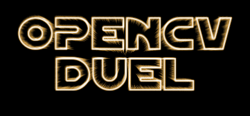

# OpenCV Duel: Interactive Sword-Fighting Game Using Mediapipe and Python



This project, **OpenCV Duel**, was developed as my final project for Syracuse University's Image and Video Processing course (Fall 2022). It is an immersive sword-fighting game that uses **Python** and the **Mediapipe library** for real-time hand tracking. Players wield a virtual lightsaber, using their hand movements to block and defend against attacks from an AI-controlled opponent. The game combines custom game logic, collision detection, and sound effects to create a dynamic and interactive experience.

---

## Project Description

The goal of OpenCV Duel is to showcase the power of real-time hand tracking and computer vision for interactive game development. The system captures the player’s hand movements using a webcam, creating a dynamic virtual combat experience. The game logic overlays a **blue lightsaber** for the player and a **red lightsaber** for the AI opponent’s attacks. Immersive audio effects and scoring systems enhance gameplay.

### Key Features
- **Hand Tracking**: Leveraged Mediapipe for real-time detection and tracking of hand landmarks.
- **Lightsaber Animation**: Designed dynamic lightsaber movements with collision detection for player-enemy interactions.
- **AI Opponent Attacks**: Programmed AI-controlled attack patterns using random intervals and calculated trajectories.
- **Sound Effects**: Integrated sound effects for lightsaber clashes and hits to provide a cinematic experience.
- **Score and Lives Tracking**: Implemented a scoring system that rewards successful blocks and penalizes hits.

### Song List
The game features an iconic soundtrack:
1. **"Main Game Theme"**: Based on *Duel of the Fates* by John Williams (`MainGameTheme.wav`).
2. **"Title Screen Theme"**: Based on *Imperial March* by John Williams (`TitleScreenTheme.wav`).

### Sound Effects
- **Lightsaber Clash**: Plays during successful blocks (`ClashSound.wav`).
- **Lightsaber Hit**: Plays when the player gets hit (`DeathSound.wav`).

---

## System Requirements

### Prerequisites
1. **Software Setup**:
   - Python 3.7+ installed on your system.
   - Install the required libraries using pip:
     ```bash
     pip install opencv-python mediapipe pygame shapely
     ```

2. **Environment Setup**:
   - Ensure your webcam is functional for hand-tracking.
   - Place the game assets (`TitleScreenTheme.wav`, `MainGameTheme.wav`, `ClashSound.wav`, `DeathSound.wav`, and image files) in their respective folders.

---

## How to Play

1. **Launch the Game**:
   - Run the `main2.py` script to start the game:
     ```bash
     python main2.py
     ```

2. **Choose Your Device Setup**:
   - For **MacBook Users**:
     - Uncomment lines marked `#------For macbooks-------#` in the script for optimized resolution and gameplay.
   - For **Other Devices**:
     - Uncomment lines marked `#--For regular computers--#` for standard resolution.

3. **Game Instructions**:
   - Arm yourself with a virtual lightsaber by keeping your hand in the webcam frame.
   - Use your lightsaber to block incoming red lightsaber attacks from your AI opponent.
   - Gain points for successful blocks and lose points for hits. Losing all lives ends the game.

4. **Scoring**:
   - **+250 points** for successful blocks.
   - **-250 points** and **1 life lost** for hits.

---

## Files Included

### Scripts
- **`main2.py`**: The main game script containing all functionality for gameplay, including hand tracking, game logic, and scoring.

### Folders
1. **`assets`**:
   - Contains all the fonts and additional assets used in the game menu.
2. **`media`**:
   - Includes project reports and the OpenCV Duel logo.
3. **`song&effects`**:
   - Contains background music and sound effects used in the game.
4. **`testFolder`**:
   - Contains all development code and scripts that were used during the initial stages of the project but are not part of the main game logic.
5. **`videogameMedia`**:
   - Contains all the images required by the main script for gameplay, such as the background and game-over screen.

### Media
- **Gameplay Video**:
  - **PC Version**: [Watch the demo on a PC](https://drive.google.com/file/d/17c14HEw6KE3E5q-_f4ICmZSMO7wdAdym/view?usp=sharing)
  - **Mac Version**: [Watch the demo on a MacBook](https://drive.google.com/file/d/1_-gIteancUMox6R3sJgA96QCzVrj91ea/view?usp=sharing)

### Documentation
- **Final Report**: Comprehensive details on the development of OpenCV Duel, including challenges and solutions.  
  [**Read the Report**](media/OpenCVDuel_FinalReport.pdf)
- **Project Proposal**: Initial project idea and methodology.  
  [**Read the Proposal**](media/OpenCVDuel_Proposal.pdf)

---

## Reflections and Future Enhancements

### Achievements
- Successfully integrated real-time hand tracking using Mediapipe for intuitive gameplay.
- Developed dynamic lightsaber animations with precise collision detection.
- Delivered a cinematic experience with sound effects and an iconic Star Wars-inspired soundtrack.

### Future Enhancements
- **Multiplayer Mode**: Allow two players to duel using separate webcams.
- **Enhanced AI Behavior**: Implement adaptive difficulty based on player performance.
- **Additional Game Modes**: Add features like time-based challenges or survival modes.

---

## Acknowledgments

This project was developed in collaboration with:
- **Kyle Maiorana**
